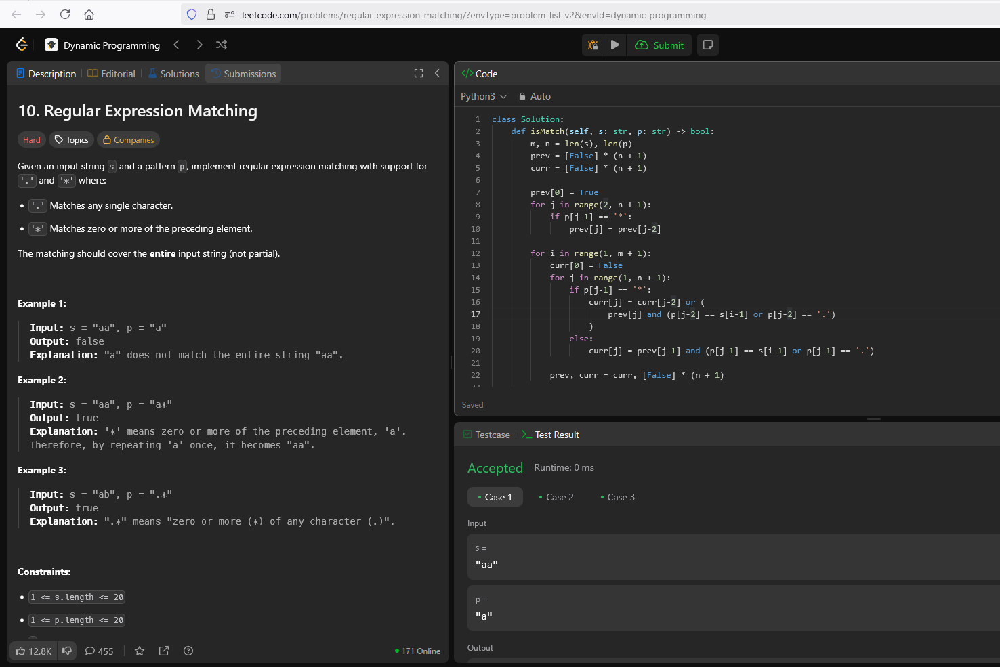

## 10. Regular Expression Matching

Esse problema consiste em encontrar correspondências entre um padrão p e uma string s, dadas como entrada do programa. Deve ser implementando a correspondência de expressões regulares com suporte para '.' e '*'. E, a correspondência deve abranger toda a string de entrada (não parte dela).

Em outras palavras, queremos saber se a string s coincidi completa com o padrão p, em que:

    . corresponde a qualquer caractere único;

    * corresponde a zero ou mais ocorrências do elemento anterior.

## Solução

Tomando por base a definição de programação dinâmica de resolver problemas complexos dividindo-os em subproblemas menores. Resolvemos o problema da seguinte forma:

### Definição do estado

Definimos uma matriz dp de dimensão (m+1)×(n+1), onde

    * m = len(s), n = len(p)

    * dp[i][j] é True se e somente se o prefixo s[:i] casa exatamente com o prefixo p[:j].

### Casos base

* dp[0][0] = True: duas strings vazias casam perfeitamente.

* Para j ≥ 2, se p[j-1] == '*', então dp[0][j] = dp[0][j-2]. Isso permite que um par “x*” seja interpretado como zero ocorrências, mantendo a string vazia.

### Regra de transição

Para cada i (1…m) e j (1…n):

    1. Se p[j-1] não for *:

        - Verificamos correspondência direta ou via ponto:

            - dp[i][j] = dp[i-1][j-1] e (s[i-1] == p[j-1] ou p[j-1] == '.')

    2. Se p[j-1] for *, há duas opções:

        - Zero ocorrências de p[j-2]:

            - dp[i][j] = dp[i][j-2]

        - Uma ou mais ocorrências:

            - dp[i][j] |= dp[i-1][j] e (s[i-1] == p[j-2] ou p[j-2] == '.')

No fim, dp[m][n] indica se toda a string s casa com o padrão p.

## LeetCode

A **Figura 1** abaixo apresenta o print de aceitação da resolução pela plataforma LeetCode.

**Figura 1:** Solução aceita pelo LeetCode.
