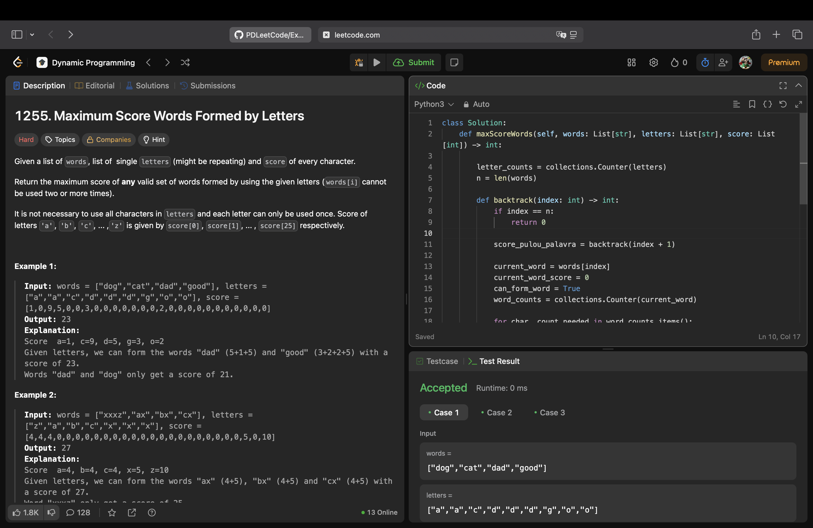

# 1255. Maximum Score Words Formed by Letters

Este problema consiste em atuar como um jogador de palavras cruzadas com recursos limitados. Recebemos:

1. Uma lista de palavras (*words*).

2. Um conjunto de letras disponíveis (*letters*), que podem se repetir.

3. A pontuação de cada letra do alfabeto (score).

O objetivo é escolher um subconjunto de palavras da lista que podemos formar usando as letras disponíveis. Cada letra/palavra da lista só pode ser usada uma vez. O objetivo final do jogo é encontrar a pontuação máxima que pode ser alcançada.

Exemplo: com o conjunto de letras ["a", "a", "c", "d", "d", "d", "g", "o", "o"] podemos formar as palavras do conjunto ["dad", "good"], já que temos letras o suficiente. A complexidade está em determinar qual combinação de palavras de toda a lista fornecida gera a maior pontuação total.

## Solução

A solução foi elaborada utilizando como base o **Problema da Mochila (*Knapsack*) 0/1**. A relação de itens, pesos e valores é a seguinte:

1. Itens: Palavras da lista *words*;

2. Valor: Soma dos pontos das letras da palavra;

3. Peso: Conjunto de letras necessárias para formar a palavra;

4. Capacidade da mochila: Conjunto de letras disponíveis (*letters*);

5. Decisão 0/1: Para cada palavra, temos a decisão de colocar na mochila (formar a palavra) ou deixar ela de fora.

Objetivo: Encher a mochila com itens (palavras) para maximizar o valor (pontuação), sem ultrapassar a capacidade da mochila (letras disponíveis).

Foi utilizada a lógica de *Backtracking* (recursão com tentativa e erro).

Para cada palavra, a função testa dois caminhos:

**Caminho 1: Ignorar a palavra atual**
A função avança para a próxima palavra, sem adicionar pontuação. A pontuação final deste caminho será o máximo que obtiver com as palavras ainda disponíveis na lista.

**Caminho 2: Incluir a palavra atual**

O algoritmo irá conferir se tem letras o suficiente em nosso conjunto disponível para formar a palavra atual.

Se for possível, calcula a pontuação da palavra, retira as letras usadas do nosso conjunto de letras disponíveis e faz uma chamada recursiva para a próxima palavra.

*Backtracking*: Após retornar da chamada recursiva, as letras usadas são adicionadas novamente ao conjunto de letras. Isso permite que elas sejam consideradas em outros caminhos da árvore de decisão.

O resultado final é o valor máximo obtido entre todas as combinações possíveis exploradas.

## LeetCode

A **Figura 1** abaixo apresenta o print de aceitação da resolução pela plataforma LeetCode.

**Figura 1:** Solução aceita pelo LeetCode.

