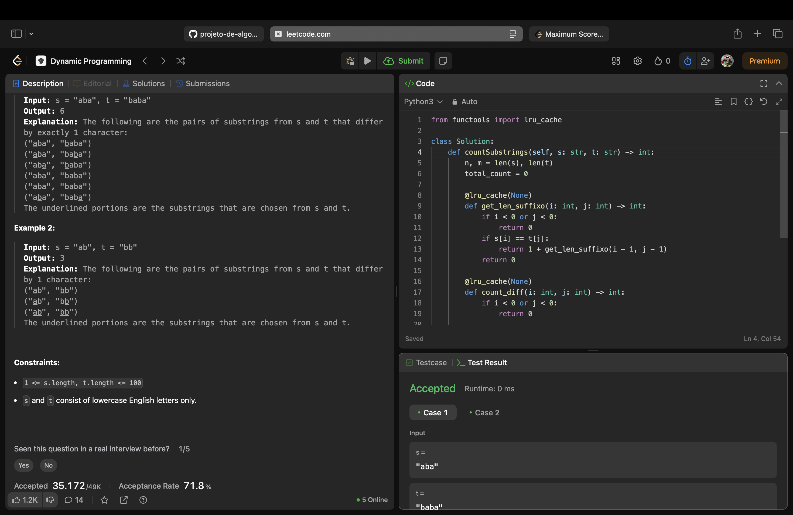

# 1638. Count Substrings That Differ by One Character

Esse problema consiste em encontrar o número total de pares de substrings (uma de uma string s, outra de uma string t) que tenham o mesmo comprimento e sejam diferentes entre si por apenas um caractere.

Considere s = "computer" e t = "computation". A substring "compute" de s e a substring "computa" de t formam um par válido. Elas têm o mesmo comprimento (7) e diferem apenas no 6o caractere. Este par aumenta em 1 a contagem total.

A comparação de todas as substrings de s com todas de t não é complicada. O desafio desse problema é comparar eficientemente todas as substrings sem apresentar lentidão.

## Solução

A solução que implementamos é um algoritmo de Programação Dinâmica recursivo com memoização. Ele funciona da seguinte maneira:

Em vez de comparar substrings inteiras repetidamente, analisamos as strings caractere a caractere e mantemos uma memória de dois estados-chave para cada par de posições (i, j):

1. **Sufixo Idêntico:** O algoritmo rastreia o comprimento (*len*) da trilha de caracteres idênticos que terminam em s[i] e t[j]. Se s[i] e t[j] são diferentes, essa trilha é zerada.

2. **Contagem de Pares:** Essa parte conta os novos pares válidos (com no máximo uma diferença) que terminam em (i, j).

    **2.1.** Se s[i] e t[j] são iguais, apenas estendemos os pares que já tinham uma diferença.

    **2.2.** Se s[i] e t[j] são diferentes, eles criam a diferença. O número de novos pares formados é exatamente o tamanho da "Trilha de Similaridade" que existia logo antes, +1 (o par de um único caractere).

**Saída:** Soma de todos os valores na **Contagem de Pares**. Cada posição (i, j) contribui com sua parcela para o todo. A solução tem complexidade de tempo O(n * m).

## LeetCode

A **Figura 1** abaixo apresenta o print de aceitação da resolução pela plataforma LeetCode.

**Figura 1:** Solução aceita pelo LeetCode.

