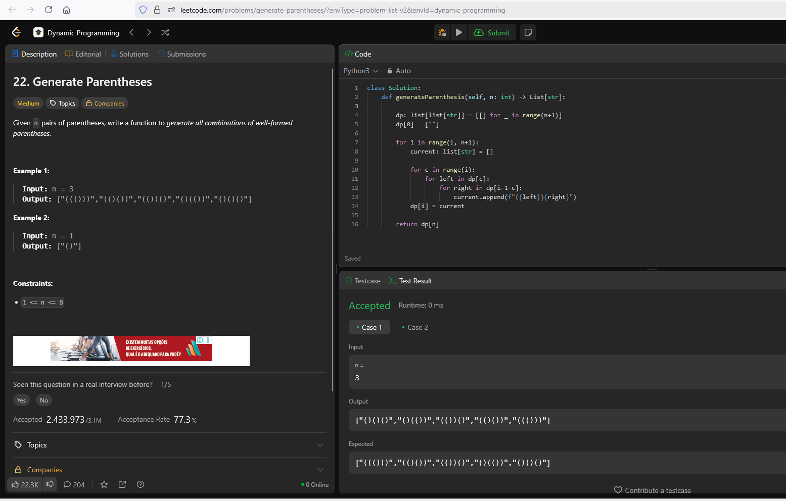

# 22. Generate Parentheses


Esse problema consiste em gerar todas as combinações de parênteses bem formados, ou seja, abrindo "(" e fechando ")" os parênteses, a partir de n pares de parênteses dados no início do problema.


## Solução

Em programação dinâmica, exploramos a decomposição recursiva da estrutura: toda sequência de tamanho i se forma unindo um par “(…)” com dois picos internos e externos, refletindo exatamente a recorrência de Catalan*. Ele funciona da seguinte maneira:


1. Definimos dp[i] como a lista de todas as sequências bem formadas com i pares.

2. Caso Base: dp[0] = [""].

3. Transição: para cada i ≥ 1, dividimos os i pares em dois blocos:

    - c pares dentro do primeiro “(…)”

    - i−1−c pares depois desse bloco

Da seguinte forma:
```
dp[i] = [
  "(" + x + ")" + y
  for c in range(i)
    for x in dp[c]
    for y in dp[i-1-c]
]
```

4. No fim, dp[n] entrega todas as combinações. Essa formulação replica a soma de produtos típica dos números de Catalan*.


/* Os [números de Catalan](https://pt.wikipedia.org/wiki/N%C3%BAmeros_de_Catalan) são uma sequência de números naturais que aparecem em diversos problemas de combinatória, frequentemente envolvendo objetos definidos recursivamente.


## LeetCode

A **Figura 1** abaixo apresenta o print de aceitação da resolução pela plataforma LeetCode.



**Figura 1:** Solução aceita pelo LeetCode.
